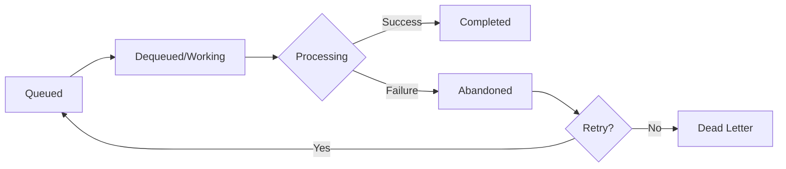

# Queues

Queues offer First In, First Out (FIFO) message delivery with reliable processing semantics. Foundatio provides multiple queue implementations through the `IQueue<T>` interface.

## The IQueue Interface

```csharp
public interface IQueue<T> : IQueue where T : class
{
    AsyncEvent<EnqueuingEventArgs<T>> Enqueuing { get; }
    AsyncEvent<EnqueuedEventArgs<T>> Enqueued { get; }
    AsyncEvent<DequeuedEventArgs<T>> Dequeued { get; }
    AsyncEvent<LockRenewedEventArgs<T>> LockRenewed { get; }
    AsyncEvent<CompletedEventArgs<T>> Completed { get; }
    AsyncEvent<AbandonedEventArgs<T>> Abandoned { get; }

    void AttachBehavior(IQueueBehavior<T> behavior);
    Task<string> EnqueueAsync(T data, QueueEntryOptions options = null);
    Task<IQueueEntry<T>> DequeueAsync(CancellationToken cancellationToken);
    Task<IQueueEntry<T>> DequeueAsync(TimeSpan? timeout = null);
    Task RenewLockAsync(IQueueEntry<T> queueEntry);
    Task CompleteAsync(IQueueEntry<T> queueEntry);
    Task AbandonAsync(IQueueEntry<T> queueEntry);
    Task<IEnumerable<T>> GetDeadletterItemsAsync(CancellationToken cancellationToken = default);
    Task StartWorkingAsync(Func<IQueueEntry<T>, CancellationToken, Task> handler,
                           bool autoComplete = false,
                           CancellationToken cancellationToken = default);
}

public interface IQueue : IHaveSerializer, IDisposable
{
    Task<QueueStats> GetQueueStatsAsync();
    Task DeleteQueueAsync();
    string QueueId { get; }
}
```

## Implementations

### InMemoryQueue

An in-memory queue implementation for development and testing:

```csharp
using Foundatio.Queues;

var queue = new InMemoryQueue<WorkItem>();

// Enqueue work
await queue.EnqueueAsync(new WorkItem { Id = 1, Data = "Hello" });

// Dequeue and process
var entry = await queue.DequeueAsync();
Console.WriteLine($"Processing: {entry.Value.Data}");
await entry.CompleteAsync();
```

### RedisQueue

Distributed queue using Redis (separate package):

```csharp
// dotnet add package Foundatio.Redis

using Foundatio.Redis.Queues;

var queue = new RedisQueue<WorkItem>(o => {
    o.ConnectionMultiplexer = redis;
    o.Name = "work-items";
    o.WorkItemTimeout = TimeSpan.FromMinutes(5);
});
```

### AzureServiceBusQueue

Queue using Azure Service Bus (separate package):

```csharp
// dotnet add package Foundatio.AzureServiceBus

using Foundatio.AzureServiceBus.Queues;

var queue = new AzureServiceBusQueue<WorkItem>(o => {
    o.ConnectionString = "...";
    o.Name = "work-items";
});
```

### AzureStorageQueue

Queue using Azure Storage Queues (separate package):

```csharp
// dotnet add package Foundatio.AzureStorage

using Foundatio.AzureStorage.Queues;

var queue = new AzureStorageQueue<WorkItem>(o => {
    o.ConnectionString = "...";
    o.Name = "work-items";
});
```

### SQSQueue

Queue using AWS SQS (separate package):

```csharp
// dotnet add package Foundatio.AWS

using Foundatio.AWS.Queues;

var queue = new SQSQueue<WorkItem>(o => {
    o.Region = RegionEndpoint.USEast1;
    o.QueueName = "work-items";
});
```

## Queue Entry Lifecycle

Each dequeued message goes through a lifecycle:



### Completing Entries

Mark an entry as successfully processed:

```csharp
var entry = await queue.DequeueAsync();
try
{
    await ProcessAsync(entry.Value);
    await entry.CompleteAsync();
}
catch
{
    await entry.AbandonAsync();
    throw;
}
```

### Abandoning Entries

Return an entry to the queue for retry:

```csharp
var entry = await queue.DequeueAsync();
if (!CanProcess(entry.Value))
{
    // Return to queue for later processing
    await entry.AbandonAsync();
    return;
}
```

### Lock Renewal

For long-running operations, renew the lock:

```csharp
var entry = await queue.DequeueAsync();
using var cts = new CancellationTokenSource();

// Renew lock periodically
var renewTask = Task.Run(async () =>
{
    while (!cts.Token.IsCancellationRequested)
    {
        await Task.Delay(TimeSpan.FromSeconds(30), cts.Token);
        await entry.RenewLockAsync();
    }
});

try
{
    await LongRunningProcessAsync(entry.Value);
    await entry.CompleteAsync();
}
finally
{
    cts.Cancel();
}
```

## Processing Patterns

### Simple Processing Loop

```csharp
while (!cancellationToken.IsCancellationRequested)
{
    var entry = await queue.DequeueAsync(cancellationToken);
    if (entry == null) continue;

    try
    {
        await ProcessAsync(entry.Value);
        await entry.CompleteAsync();
    }
    catch (Exception ex)
    {
        _logger.LogError(ex, "Failed to process {Id}", entry.Value.Id);
        await entry.AbandonAsync();
    }
}
```

### Using StartWorkingAsync

Simplified background processing:

```csharp
// Start processing in background
await queue.StartWorkingAsync(
    async (entry, ct) =>
    {
        await ProcessAsync(entry.Value);
    },
    autoComplete: true,  // Automatically complete on success
    cancellationToken
);
```

### Parallel Processing

Process multiple items concurrently:

```csharp
var semaphore = new SemaphoreSlim(maxConcurrency);

while (!cancellationToken.IsCancellationRequested)
{
    await semaphore.WaitAsync(cancellationToken);

    _ = Task.Run(async () =>
    {
        try
        {
            var entry = await queue.DequeueAsync(cancellationToken);
            if (entry != null)
            {
                await ProcessAsync(entry.Value);
                await entry.CompleteAsync();
            }
        }
        finally
        {
            semaphore.Release();
        }
    });
}
```

## Queue Entry Options

Configure enqueue behavior:

```csharp
await queue.EnqueueAsync(new WorkItem { Id = 1 }, new QueueEntryOptions
{
    UniqueId = "unique-id",           // Dedupe by ID
    CorrelationId = "request-123",    // For tracing
    DeliveryDelay = TimeSpan.FromMinutes(5),  // Delayed delivery
    Properties = new Dictionary<string, string>
    {
        ["priority"] = "high"
    }
});
```

## Queue Events

Subscribe to queue lifecycle events:

```csharp
var queue = new InMemoryQueue<WorkItem>();

queue.Enqueuing.AddHandler(async (sender, args) =>
{
    _logger.LogInformation("Enqueuing: {Data}", args.Entry.Value);
});

queue.Enqueued.AddHandler(async (sender, args) =>
{
    _logger.LogInformation("Enqueued: {Id}", args.Entry.Id);
});

queue.Dequeued.AddHandler(async (sender, args) =>
{
    _logger.LogInformation("Dequeued: {Id}", args.Entry.Id);
});

queue.Completed.AddHandler(async (sender, args) =>
{
    _logger.LogInformation("Completed: {Id}", args.Entry.Id);
});

queue.Abandoned.AddHandler(async (sender, args) =>
{
    _logger.LogWarning("Abandoned: {Id}", args.Entry.Id);
});
```

## Queue Behaviors

Extend queue functionality with behaviors:

```csharp
public class LoggingQueueBehavior<T> : IQueueBehavior<T> where T : class
{
    private readonly ILogger _logger;

    public LoggingQueueBehavior(ILogger logger) => _logger = logger;

    public void Attach(IQueue<T> queue)
    {
        queue.Enqueued.AddHandler(async (s, e) =>
            _logger.LogInformation("Enqueued {Id}", e.Entry.Id));

        queue.Completed.AddHandler(async (s, e) =>
            _logger.LogInformation("Completed {Id}", e.Entry.Id));
    }
}

// Attach to queue
queue.AttachBehavior(new LoggingQueueBehavior<WorkItem>(logger));
```

## Queue Statistics

Monitor queue health:

```csharp
var stats = await queue.GetQueueStatsAsync();

Console.WriteLine($"Queued: {stats.Queued}");
Console.WriteLine($"Working: {stats.Working}");
Console.WriteLine($"Dead Letter: {stats.Deadletter}");
Console.WriteLine($"Enqueued: {stats.Enqueued}");
Console.WriteLine($"Dequeued: {stats.Dequeued}");
Console.WriteLine($"Completed: {stats.Completed}");
Console.WriteLine($"Abandoned: {stats.Abandoned}");
Console.WriteLine($"Errors: {stats.Errors}");
Console.WriteLine($"Timeouts: {stats.Timeouts}");
```

## Dead Letter Queue

Handle failed messages:

```csharp
// Get dead letter items
var deadLetters = await queue.GetDeadletterItemsAsync();

foreach (var item in deadLetters)
{
    _logger.LogWarning("Dead letter: {Id}", item.Id);

    // Optionally re-queue for retry
    await queue.EnqueueAsync(item);
}
```

## Dependency Injection

### Basic Registration

```csharp
// In-memory (development)
services.AddSingleton<IQueue<WorkItem>>(sp =>
    new InMemoryQueue<WorkItem>());

// Redis (production)
services.AddSingleton<IQueue<WorkItem>>(sp =>
    new RedisQueue<WorkItem>(o => {
        o.ConnectionMultiplexer = sp.GetRequiredService<IConnectionMultiplexer>();
        o.Name = "work-items";
    }));
```

### Multiple Queues

```csharp
services.AddSingleton<IQueue<OrderWorkItem>>(sp =>
    new InMemoryQueue<OrderWorkItem>(o => o.Name = "orders"));

services.AddSingleton<IQueue<EmailWorkItem>>(sp =>
    new InMemoryQueue<EmailWorkItem>(o => o.Name = "emails"));
```

## Best Practices

### 1. Use Typed Messages

```csharp
// ✅ Good: Typed, versioned messages
public record OrderWorkItem
{
    public int Version { get; init; } = 1;
    public required int OrderId { get; init; }
    public required DateTime CreatedAt { get; init; }
}

// ❌ Bad: Generic, untyped
public class WorkItem
{
    public object Data { get; set; }
}
```

### 2. Handle Idempotency

```csharp
var entry = await queue.DequeueAsync();

// Check if already processed
if (await _processedIds.ContainsAsync(entry.Value.Id))
{
    await entry.CompleteAsync();
    return;
}

// Process
await ProcessAsync(entry.Value);

// Mark as processed
await _processedIds.AddAsync(entry.Value.Id);
await entry.CompleteAsync();
```

### 3. Set Appropriate Timeouts

```csharp
var queue = new RedisQueue<WorkItem>(o => {
    o.WorkItemTimeout = TimeSpan.FromMinutes(5);  // How long to process
    o.RetryDelay = TimeSpan.FromSeconds(30);      // Delay before retry
    o.RetryLimit = 3;                              // Max retries
});
```

### 4. Monitor Queue Depth

```csharp
var stats = await queue.GetQueueStatsAsync();
if (stats.Queued > 1000)
{
    _logger.LogWarning("Queue depth is high: {Depth}", stats.Queued);
    // Consider scaling workers
}
```

### 5. Use Delayed Delivery for Scheduling

```csharp
// Schedule for later
await queue.EnqueueAsync(reminder, new QueueEntryOptions
{
    DeliveryDelay = TimeSpan.FromHours(24)
});
```

## Next Steps

- [Jobs](./jobs) - Queue processor jobs for background processing
- [Messaging](./messaging) - Pub/sub for event-driven patterns
- [Locks](./locks) - Coordinate queue processing across instances
